Step 3 includes all the necessary steps to create the Qualtrics survey/test. We demonstrate the procedure using the PPSE item bank; however, you can follow the same steps using your own item bank. To use the TCAT item bank, specific instructions are provided where necessary.

### Step 3.1 - Setup Block

Enter the Qualtrics website and log in with your credentials.

Go to **Home page** — **Create a new project** — **Survey** — and click **Get started.**

Enter a Name for the Qualtrics project.

::: callout-note
The Qualtric project name is **not** the same as the Test name you specified on this tutorial.
:::

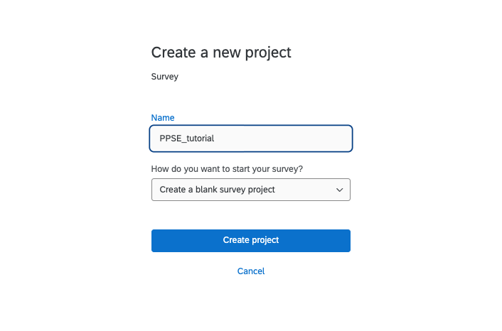{fig-align="center" width="450"}

Once you create a new project, modify the default first question. Click on it to select it.

Then from the left panel, under **Question Type**, choose **Text entry** type of question.

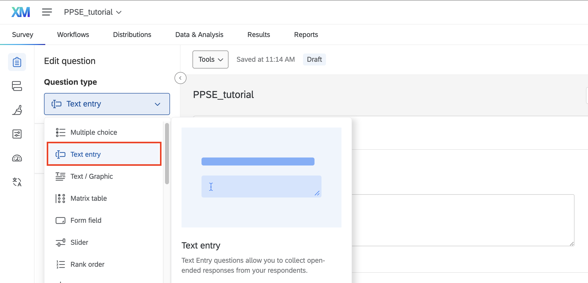{#sc2 fig-align="center"}

Change the question text to '**Test Name**'.

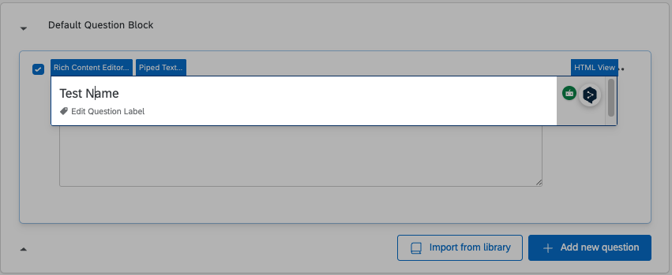{fig-align="center"}

Then, click on the three dots menu on the right corner of the 'Test Name' question and select **Copy** to create new question of similar type.

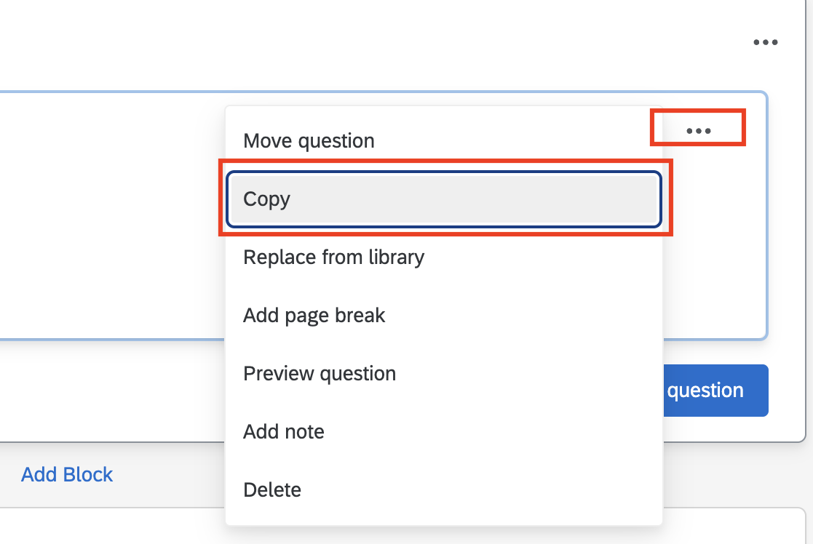{fig-align="center" width="400"}

Change the question text to '**Access Token'** at the second question.

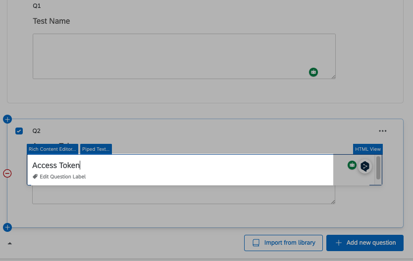{fig-align="center"}

These two questions belong to a single block, which will be the first block in your test. This block is crucial, as it links the Qualtrics survey to the correct test specifications you set up in Steps 1 and 2.

Rename the first Block as '**Setup**' block, by changing the label above the first question.

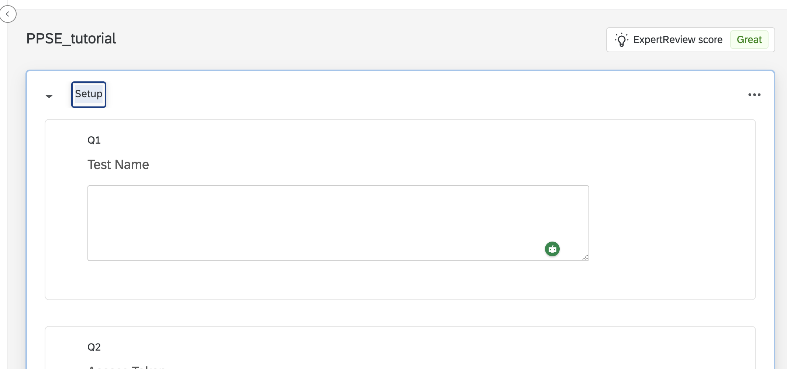

Then, for the '**Test Name'** question, select **Add requirements** and **Force response** under the **Response Requirements** options on the left panel.

Repeat for the '**Access Token'** question.

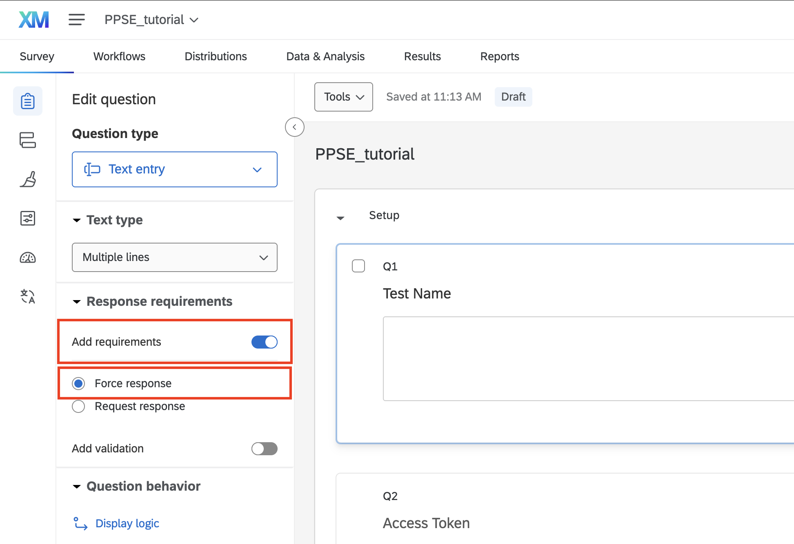

Then, for the '**Test Name'** question select '**Default choices**' from the options on the left panel. Enter the name of your test in the first question as the default choice, and click '**Save**'.

Then repeat the process for the second question, entering the access token that you generated previously.

::: callout-note
Here we follow the PPSE by entering `PPSE` as the test name and `Tok1234` as the access token. For the TCAT: Enter `TCAT` as the test name and `Tok1234` as the access token.
:::

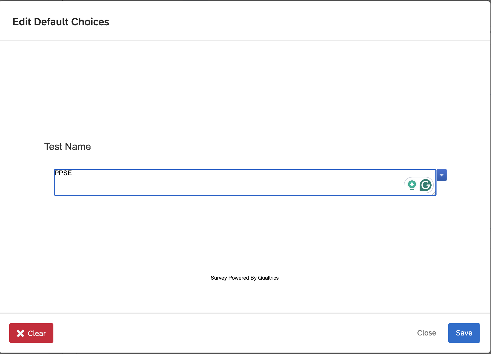

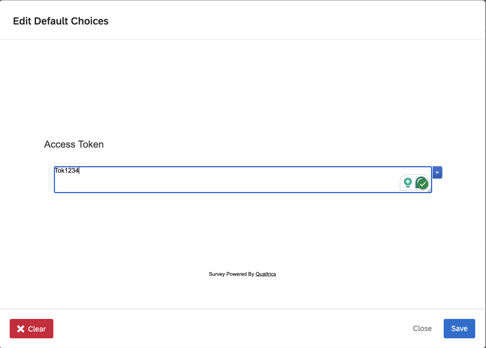

Then select the '**Access Token**' question and click the JavaScript option on the left side panel.

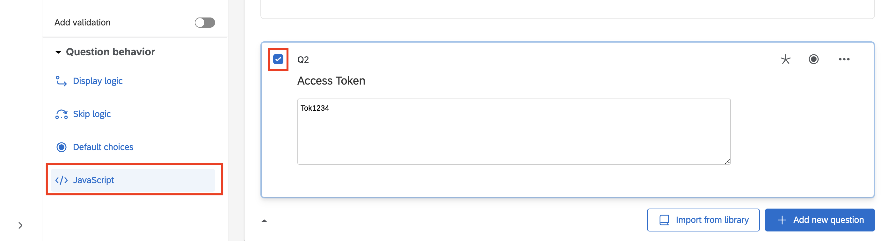

Replace the default lines of code in the pop-up window with the script below and click **Save.**

``` javascript
Qualtrics.SurveyEngine.addOnload(function() {
	 this.hideNextButton();
    var that = this;
    (function(){that.clickNextButton();}).delay(1);
});
```

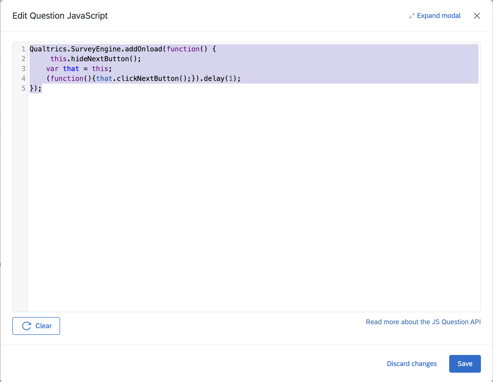

------------------------------------------------------------------------

### Step 3.2 Introduction Block (*optional*)

This block consists of a text question. It is optional and can be used to display introductory text for your study, such as guidelines, ethical approvals, participation consent, and contact information.

1.  Add a new block by selecting **Add Block**

2.  Rename the new block as 'Intro'

3.  Add new question to the block by selecting '**Add new question'**

4.  and then '**Text / Graphic**' type

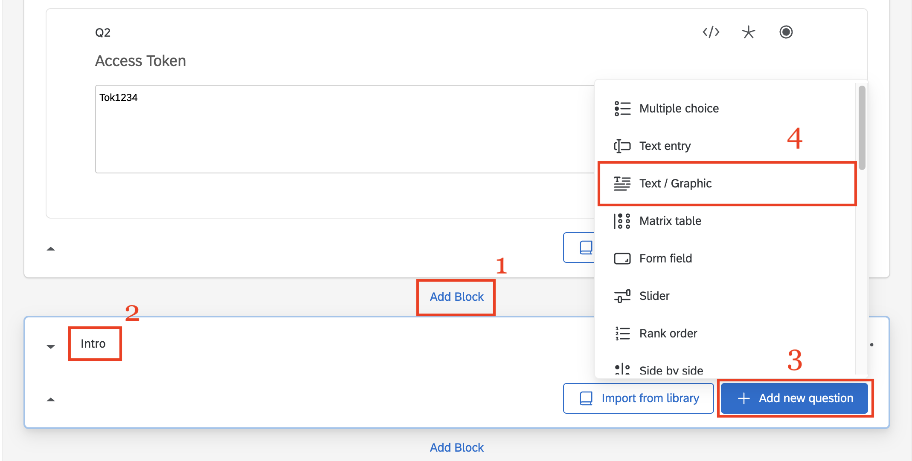

This does not serve as an actual question; rather, it displays all the necessary information for the test user.

In this example we add some plain text:


------------------------------------------------------------------------

### Step 3.2 Extra Block (*optional*)

Similarly to the Intro block, you can add an additional block, here labelled as **‘Extra’**, with questions you would like to appear before the actual CAT. These may include demographic or other personal questions. In this example, the 'Extra' block consists of two *dummy* questions: One is for gender and the other is for age.

::: callout-note
No CAT methods are configured for the ‘Extra Block'. All users will be asked the same questions.
:::

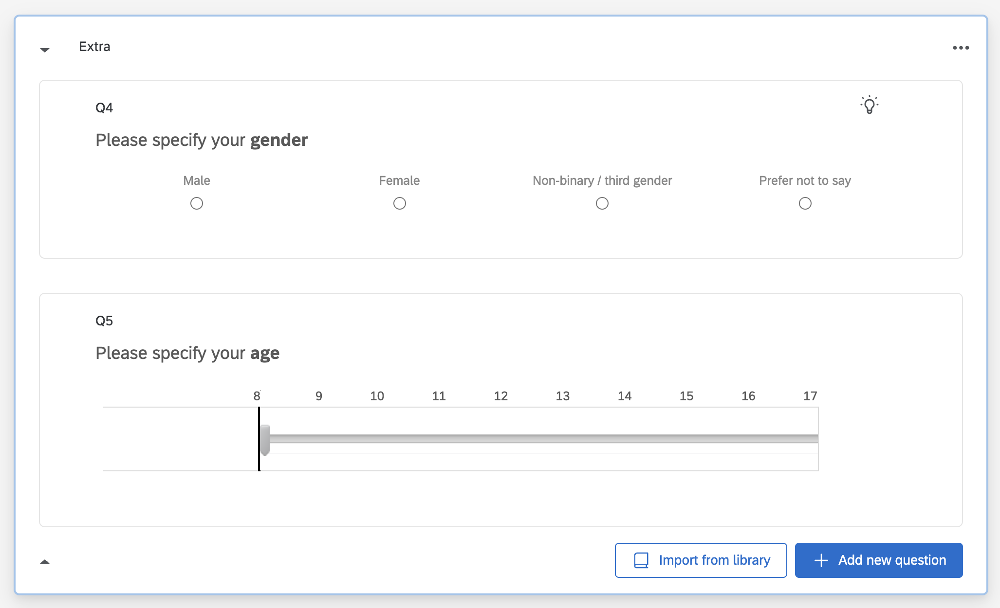

------------------------------------------------------------------------

### Step 3.3 CAT Initialization Block

Similarly,

1.  Add a new block,
2.  Rename it to 'Init'
3.  Add a new **Text / Entry** question type,
4.  Enter the phrase 'Loading...' as question text.

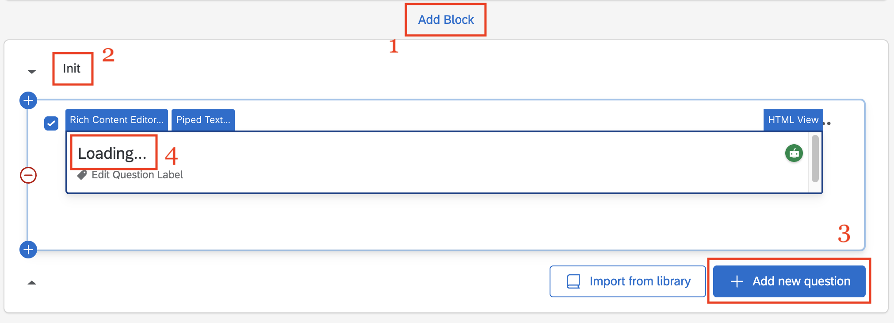{fig-align="center"}

For the 'Loading...' question, select the '**Javascript'** option from the left panel.


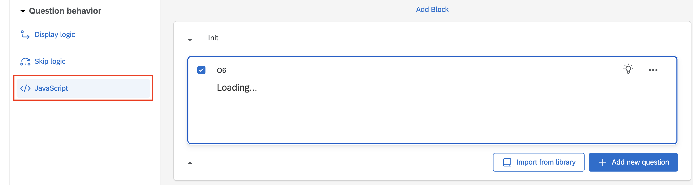

Replace the default lines of code in the pop-up window with the script below and click '**Save**':

``` javascript
Qualtrics.SurveyEngine.addOnload(function() {
    let answers = {
	  // empty for now
  };
  
  //console.log(answers);
    // CALL
    fetch("https://qualcat.duckdns.org/api/v0/init", {
    method: "POST",
    headers: {
      "Content-Type": "application/json",
      "x-api-key": "${q://QID2/ChoiceTextEntryValue}", // passwrd
      "userid": "${e://Field/SessionID}", // username
      "catName": "${q://QID1/ChoiceTextEntryValue}" // CAT name
    },
    body: JSON.stringify(answers)
  })
  .then(response => response.json())
  .then(data => {
    console.log("API returned:", data); // Debug
    // Store the API result in Embedded Data
    Qualtrics.SurveyEngine.setEmbeddedData("stop_crit", data.stop_crit);
    Qualtrics.SurveyEngine.setEmbeddedData("next_q", data.next_q);
    Qualtrics.SurveyEngine.setEmbeddedData("item_num", data.item_num);
    var arr = data.choices;
    for (var i = 0; i < arr.length; i++) {
        var varName = "choice" + (i + 1);
        Qualtrics.SurveyEngine.setEmbeddedData(varName, arr[i]);
    }
  })
  .catch(err => console.error("API error:", err));
    this.hideNextButton();
    var that = this;
    (function(){that.clickNextButton();}).delay(4);
});
```

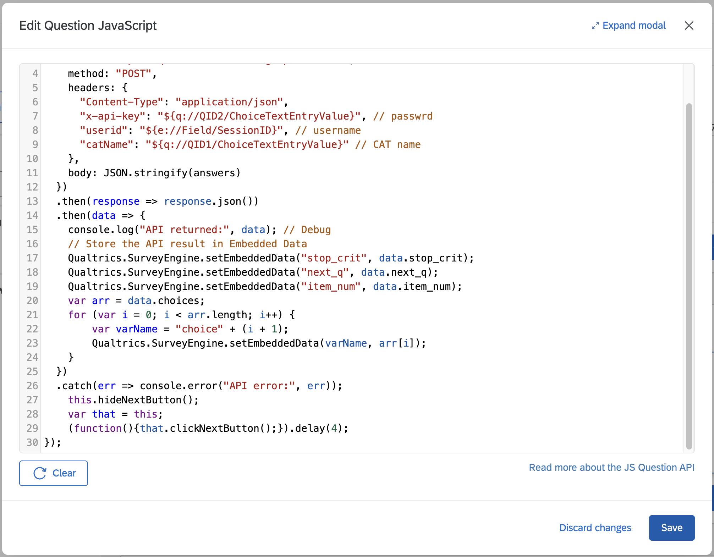

------------------------------------------------------------------------

### Step 3.4 Question Block

Add a new block, labelled as '**Question**'.

Then, add a **Multiple choice** question type.

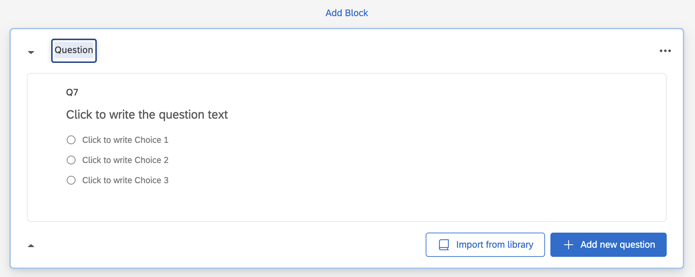

-   Select **Choices** from the left panel and choose the number of response options for your test under **Number of choices**. Here is set to 5 for the PPSE questionnaire.

    ::: callout-note
    For the TCAT: Select 4 number of choices.
    :::

-   Replace the 'Click to write the question text' with this line of code `${e://Field/next_q}`

-   Replace the 'Click to write Choice 1' with `${e://Field/choice1},`'Click to write Choice 2' with `${e://Field/choice2}` , 'Click to write Choice 3' with `${e://Field/choice3}` and so on for all available choices.

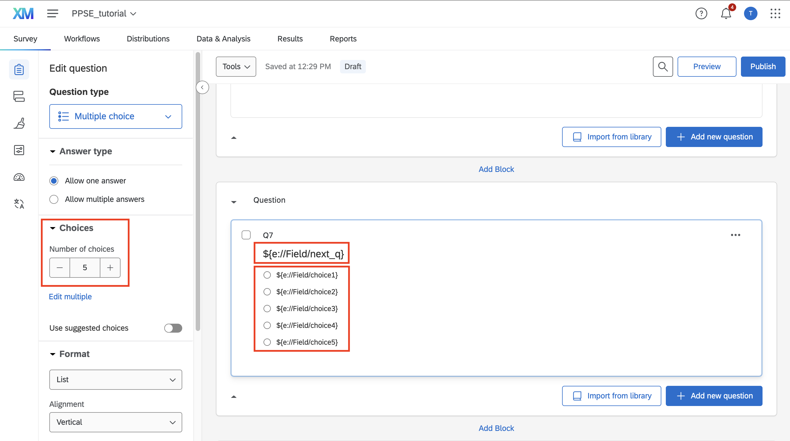

Next, click the '**Javascript**' button on the left side panel, and replace code, paste the following script and click '**Save**':

``` javascript
Qualtrics.SurveyEngine.addOnReady(function() {

    // 1. clear Qualtrics internal answer
    this.setChoiceValue("", false);

    // 2. clear any recorded choice values
    var choices = this.getChoices();
    for (var i = 0; i < choices.length; i++) {
        this.setChoiceValue(choices[i], false);
    }

    // 3. clear UI radios
    jQuery("#" + this.questionId + " input[type='radio']").prop("checked", false);
});
```

------------------------------------------------------------------------

::: callout-tip
For TCAT, and for maximum-performance test in general you should consider display the answer choices in a random order. When you make the item bank information file in Step 2, it is convenient to paste all the correct answers into column `Choice1` and make the `Scores` column the same for all the items (e.g. `1000` for dichotomous items).
:::

::: callout-warning
For typical-performance test, like the PPSE example we demonstrate here, DO NOT display answers in random order. Please, continue to Step 3.5.
:::

-   Select the question in the 'Question' block.

-   Select the **'Choice randomization'** optionin the left side panel.

-   Then choose '**Display answers in a random order**' and click '**Save**'.

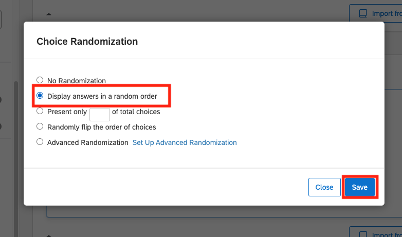{width="600"}

------------------------------------------------------------------------

### Step 3.5 - Main CAT Block

1.  Add a new question block
2.  Name it 'CAT'
3.  Add a new question,
4.  **Text/Graphic** type of question
5.  Replace the question text with an empty space.
6.  Then, click **JavaScript,** and replace everything with the following JavaScript code

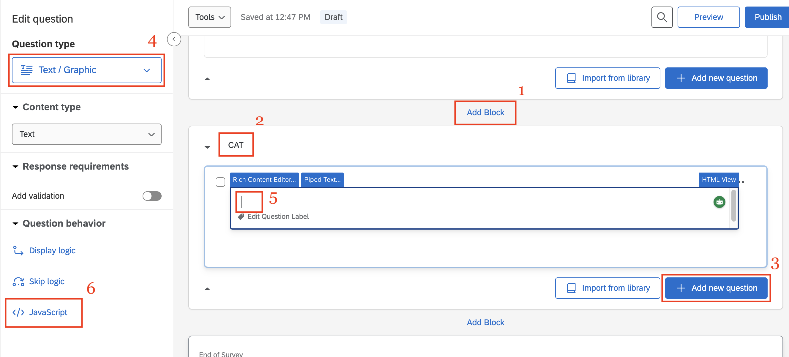

``` javascript
Qualtrics.SurveyEngine.addOnload(function()
{
     let answers = {
    q_resp: "${q://QID7/SelectedChoicesRecode}",
    item_num: "${e://Field/item_num}"
  };
  
  console.log("API sent:", answers);
    // CALL
    fetch("https://qualcat.duckdns.org/api/v0/cat", {
    method: "POST",
    headers: {
         "Content-Type": "application/json",
      "x-api-key": "${q://QID2/ChoiceTextEntryValue}", // token
      "userid": "${e://Field/SessionID}", // username
      "catName": "${q://QID1/ChoiceTextEntryValue}" // CAT name
    },
    body: JSON.stringify(answers)
  })
  .then(res => res.json())
  .then(data => {
    console.log("API returned:", data); 
    // Store the API result in Embedded Data
    Qualtrics.SurveyEngine.setEmbeddedData("iter", data.iter);
    Qualtrics.SurveyEngine.setEmbeddedData("next_q", data.item);
    Qualtrics.SurveyEngine.setEmbeddedData("item_num", data.item_num);
    Qualtrics.SurveyEngine.setEmbeddedData("se_thetahat", data.se_thetahat);
    Qualtrics.SurveyEngine.setEmbeddedData("thetahat", data.thetahat);  
    Qualtrics.SurveyEngine.setEmbeddedData("pat", data.pat);
    Qualtrics.SurveyEngine.setEmbeddedData("J", data.pat.length);
    Qualtrics.SurveyEngine.setEmbeddedData("adm_items", data.iter);
    Qualtrics.SurveyEngine.setEmbeddedData("stop", data.stop); //v0.2
    var arr = data.choices;
    for (var i = 0; i < arr.length; i++) {
        var varName = "choice" + (i + 1);
        Qualtrics.SurveyEngine.setEmbeddedData(varName, arr[i]);
    }
  })
  .catch(err => console.error("API error:", err));

    this.hideNextButton();
    var that = this;
    (function(){that.clickNextButton();}).delay(1);

});
```

::: callout-warning
## Important

Click the drop down **Tools** Tab and select "**Show internal IDs**'

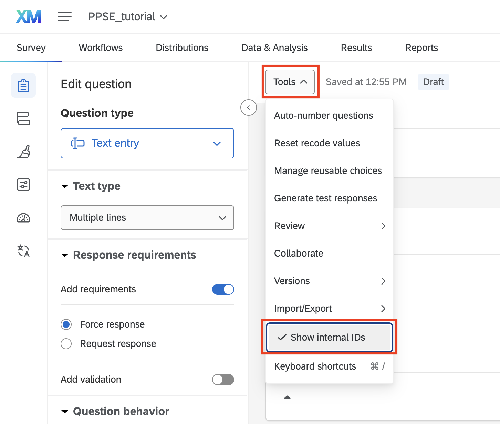{width="500"}

Make sure that the internal ID, `QID8` in this example, matches the id in the fourth line of the script you entered before. If not, edit the script by entering the correct internal ID.

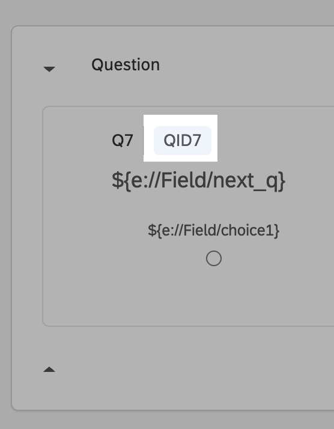{width="200"}

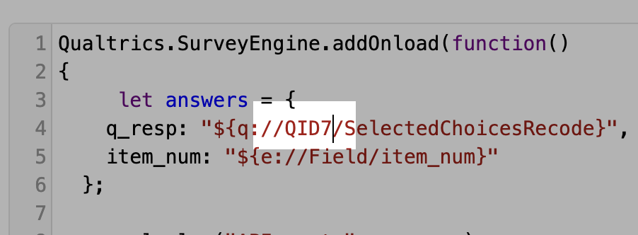{width="407"}
:::

------------------------------------------------------------------------

### Step 3.6 - Survey Flow Setup

Click the **Survey Flow** button on the left side bar.

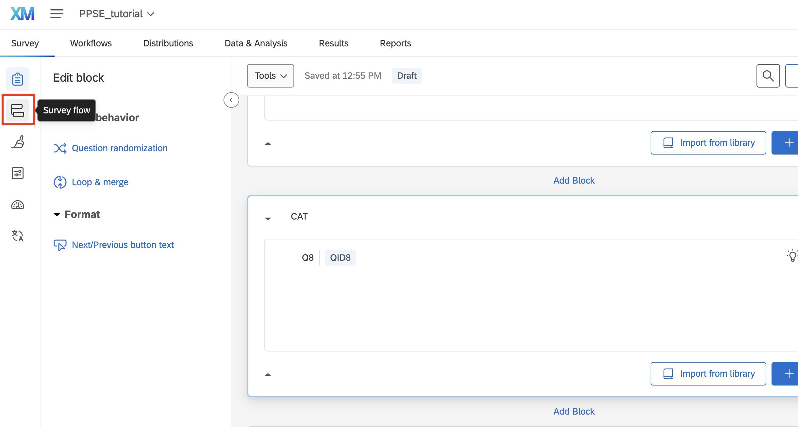

All the question blocks we created before, should be visible in a sequential flow as shown below.

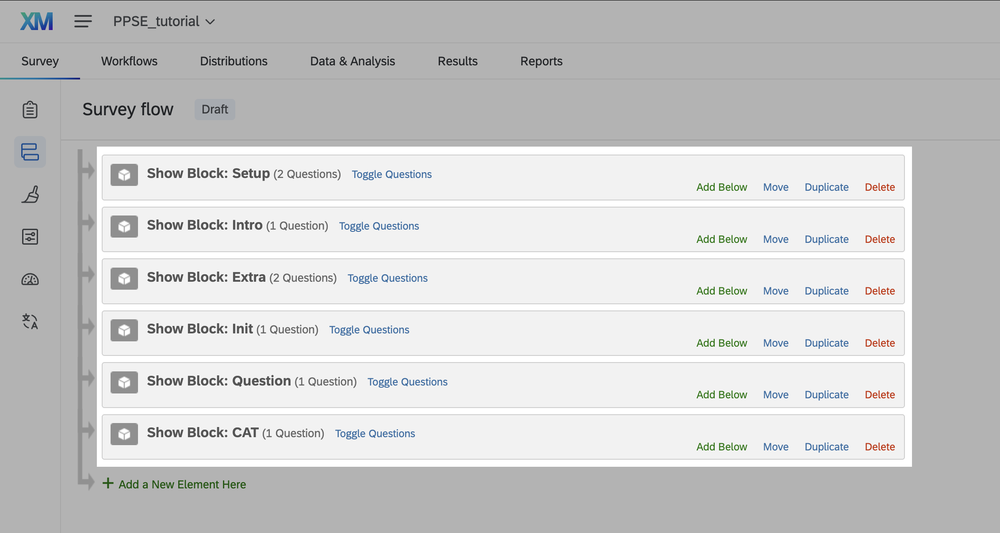

In the **Init** block, click **Add Below** and select **Group.**

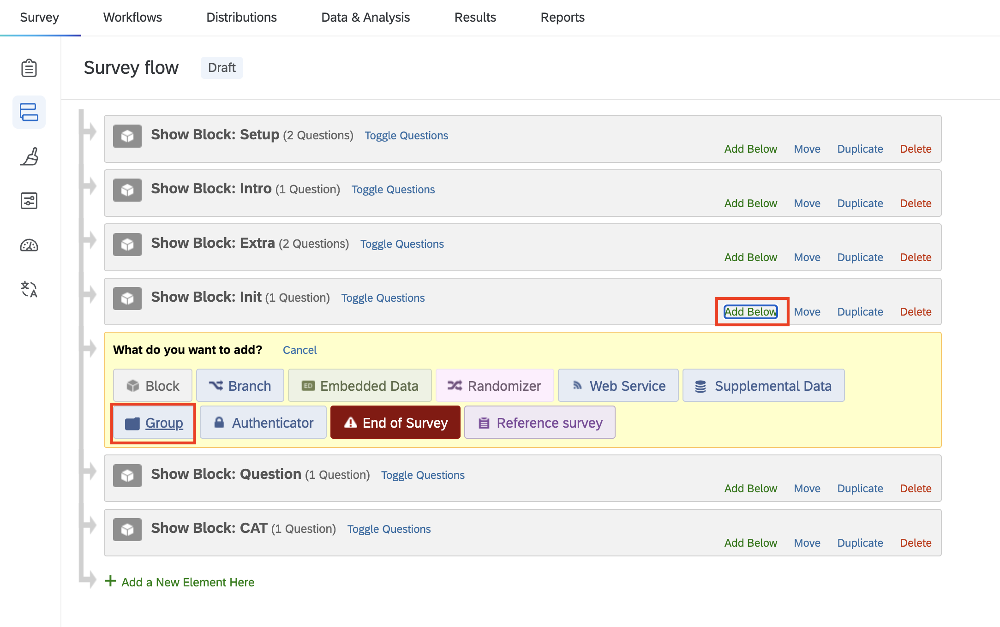

Rename the new group as 'Loop' .

Then next to the **Question** block click the **Move** button.

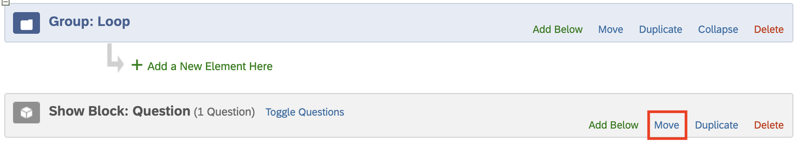

Move the **Question** block under the **Loop** groupby dragging it **.**

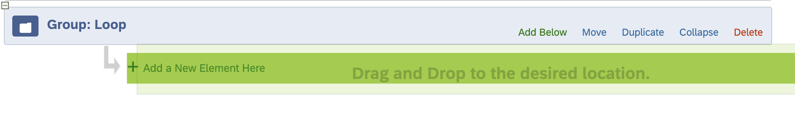

The **Question** block is now part of the Loop group.

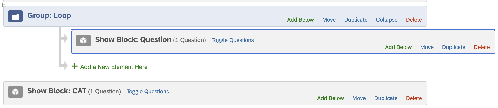

Similarly, move for the **CAT** block into the **Loop** group, under the **Question** block.

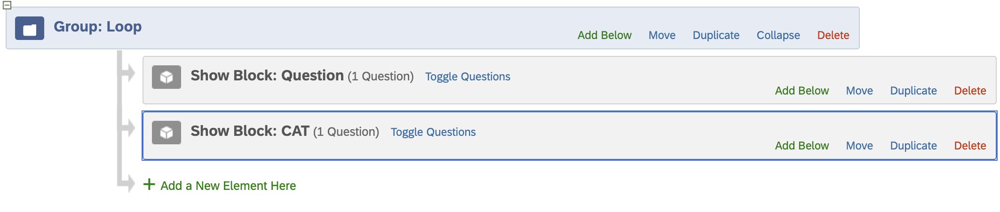

Then click '**+ Add a New Element'** under the **CAT** block, inside the **Loop** group and select '**Branch'.**

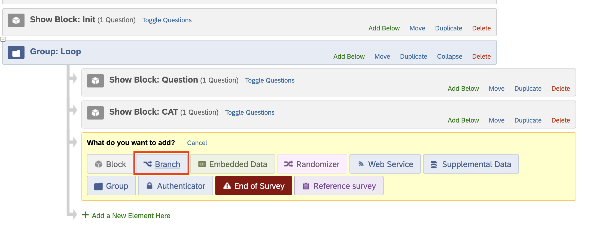

Click '**Add a Condition'**

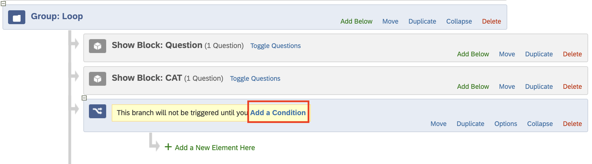

Select '**Embedded Data**'.

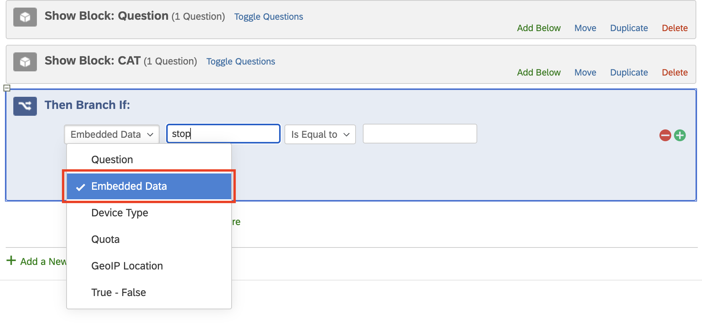

Then,

1.  Enter the word 'stop' for the embedded data

2.  Select 'Is Equal To' and enter the number '1'

3.  Click OK

4.  Add a New Element under the *if* branch

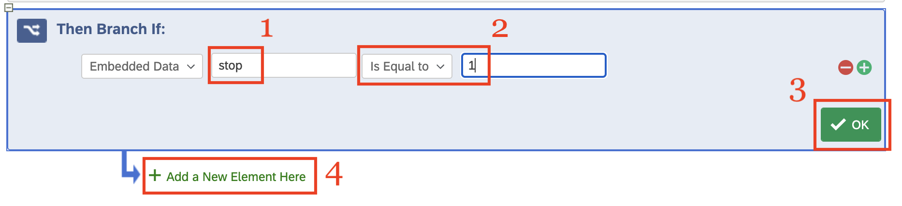

Select the **End of Survey** element

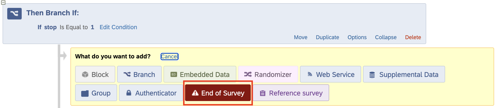

The survey flow should now look like this

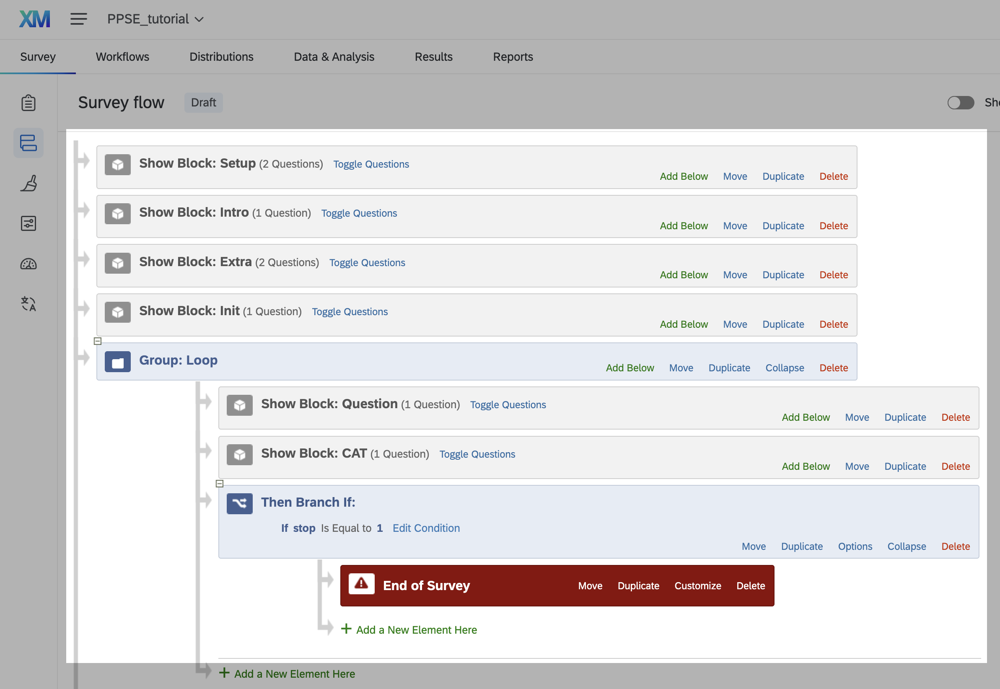

------------------------------------------------------------------------

Now, click the button **Duplicate** next to the loop group, **as many times as the available total number of items.** For this example, the PPSE item bank has a total of 19 items, therefore click the **Duplicate** button 19 times.

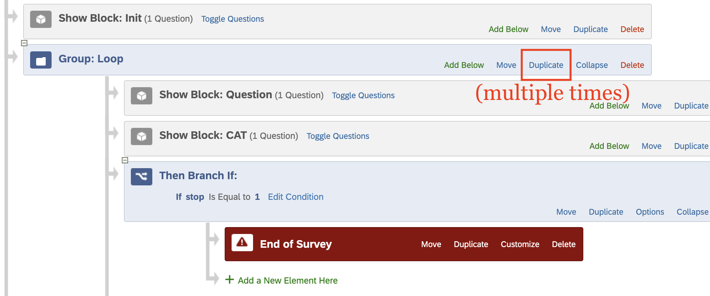

Scrolling down the Loop group should be duplicated 19 times.

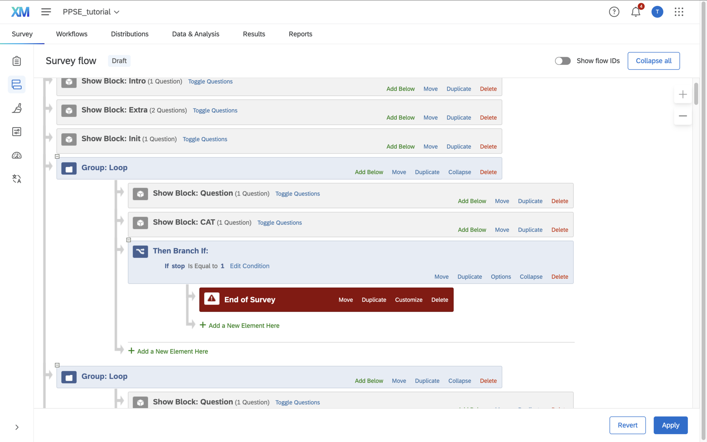

Then click **Apply** to apply this flow set up to the survey.

------------------------------------------------------------------------

### Step 3.7 - Publish the Test/Survey

1.  Go to '**Survey Options**'

2.  Select '**Responses'**

3.  Uncheck the options **Back Button** and **Allow respondents to finish later**


1.  Then go to '**Builder**' options again, and
2.  click '**Publish**'

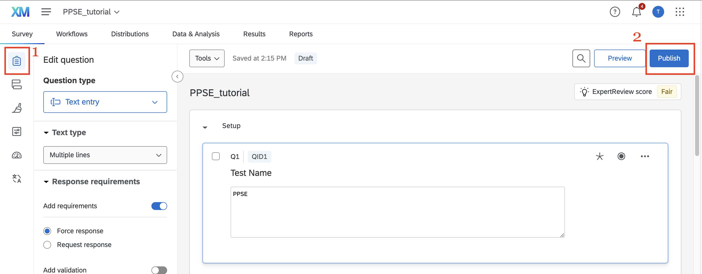

After following short instructions, the survey will be published and a unique anonymous URL will be activated.

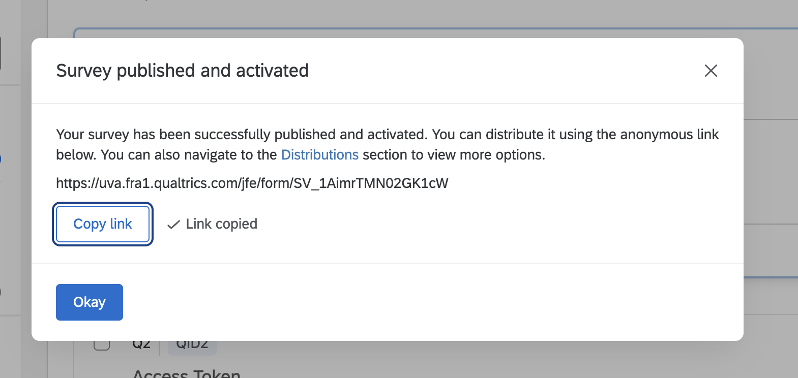

Now, the link <https://uva.fra1.qualtrics.com/jfe/form/SV_1AimrTMN02GK1cW> corresponds to a Qualtrics survey of the PROMIS Pediatric Psychological Stress Experiences (PPSE) item bank using computerized adaptive testing (CAT).

::: callout-note
For the TCAT published version go to <https://uva.fra1.qualtrics.com/jfe/form/SV_bKF45qMy1dq7Ioe>
:::
